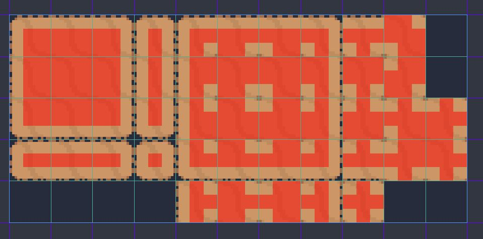

# Development

1. Change the World node back to a Node2D.

1. Add a new ysort node as a child of World.

    - Move all world objects to be children of the ysort node.

1. Delete the StaticBody2D.

1. Option 1) Add a Sprite childnode to world named "Background"

    - Assign it's texture to be ```World/GrassBackground.png```
    - Offset: Centered: Uncheck On
    - Region: Enabled: Check On
    - Check the "TextureRegion" tab at the bottom.
    - Snap Mode: Pixel Snap
    - Draw a box around the grass texture.
    - Snap Mode: Grid
    - Step: 16 x 16
    - Changing the box size will change the values in the Inspector:
        - Region -> Rect -> 'w' and 'h'

1. Make the GrassBackground sprite repeat.

    - FileSystem -> World/GrassBackground.png -> Import Tab -> Flags
        - Repeat: Enabled
    - Click reimport
    - Fill the camera space with the grass texture.
    - Renable centering of the GrassBackground Sprite
    - Transform -> Position:
        - x: 320/2
        - y: 180/2

1. Option 2) Add a TextureRect childnode to world named "TextureRectBackground".

    - Reszie to 320 x 180
    - Reorder above background and under world.
    - Assign it's texture to be ```World/GrassBackground.png```
    - Strecth Mode: Tile
    - Pros: Can drag it around in editor to resize.
    - Con: This is a control type node which isn't meant to be used like this. Meant for UI type elements.
    - HeartBeast doesn't know how significant the drawbacks are to use a TextureRect, but will use the Sprite method here.
    - Delete the TextureRectBackground

1. Create a Tilemap child note of World.

    - Place below Background
    - Cell -> Size
        - x: 16
        - y: 16
    - Tile Set: New TileSet
    - Click on the tileset to get Resource options and Tileset window.
    - In the bottom left, click the button "Add Textures to Tileset"
    - Add ```World/DirtTileset.png```
    - + New Autotile
    - Enable Snap and Show grid
    - Drag and outline the tiles to get new properties in Inspector.
    - Snap Options
        Step: 16 x 16
    - Redraw region to outline.
    - If we you click on Tilemap in nodes, you can see the new tileset.

1. Configure Tilemap

    - Click on Tileset again
    - Click on DirtTileset
    - Click window to select Region tab
    - Selected Tile:
        - Subtile Size: 16 x 16
        - Autotile Bitmask Mode: 3x3 (minimal)
 
 1. Draw the tile bitmask:
    
    - 

1. Place the autotiles

    - Select the TileMap node.
    - Select the Dirt tileset.
    - Draw!

1. Change the dirtmap tile icon.

    - Select the region, click the "Icon" tab.
    - Pick the 1x1 tile
    